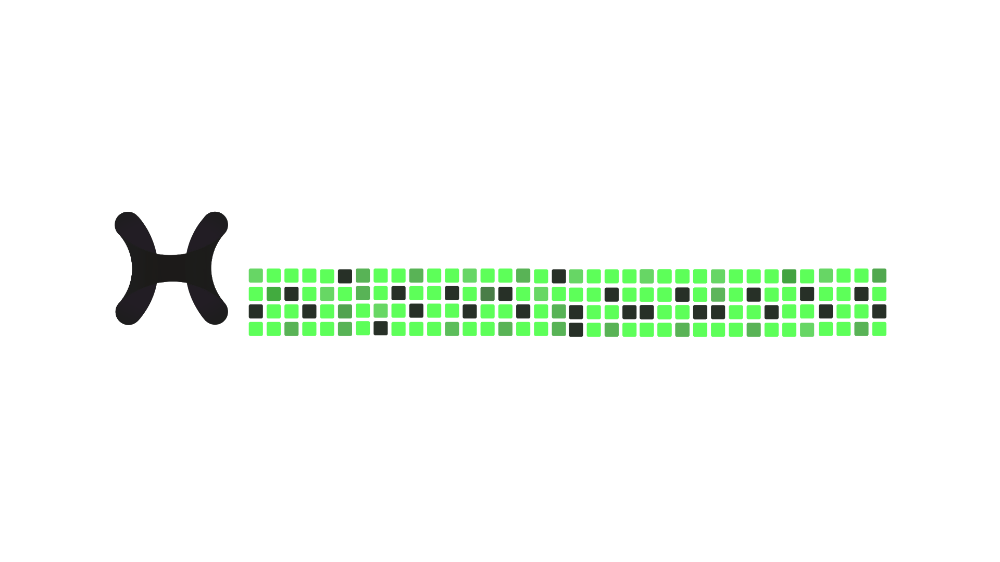

# AGTechathon 2k25

---

## 🚀 Welcome to AGTechathon

Welcome to the official repository for **AGTechathon 2k25**! Please read the following rules and guidelines carefully to ensure a smooth and fair competition.

---

## 📜 Rules & Regulations

### 1. No External Repositories

- **Do not** clone or fork codebases from outside sources or public repositories.

### 2. No Full-Tutorial Videos

- **Do not** use YouTube or other videos that provide a complete, step-by-step project tutorial.

### 3. No “Complete-Project” AI Tools

- Tools such as Cursor AI—or any service that generates an entire working project—are **strictly prohibited**.
- You may use AI tools, but only within the permitted guidelines.

### 4. Frequent Code Pushes

- Push your incremental code to the provided GitHub repository **at least every 1 hour 30 minutes**.
- **Minimum:** 1 push is mandatory.
- **Maximum:** More frequent pushes are highly encouraged.

### 5. Theme Compliance

- Your submission **must** adhere to the official hackathon theme.
- Code pushes will be monitored for compliance.

### 6. Bring Your Own Device (BYOD)

- No hardware or computers will be provided.
- Bring and use your **own** laptop or device.

### 7. Internet Access

- Wi-Fi will be provided.
- Test your laptop’s network connectivity **before** coding begins.

### 8. Pre-Event Dry-Run

- Ensure your development environment (IDE, SDKs, libraries) is fully installed and tested **prior** to the hackathon.

### 9. Official Repository Only

- A GitHub repository will be created and shared at kick-off.
- **All code must be pushed there**—no alternate repositories or branches outside the official organization.
- For hosting, fork the organization repo and host it on your own account if needed.

### 10. Break Policy

- During breaks, at least one team member must remain near your devices.
- Organizers are **not responsible** for unattended devices.

---

## 📂 Repository & Submission

- **Repo URL:** `https://github.com/AGTechathon/your-team-name`
- **Branch:** Push to `main` (or as instructed by organizers)
- **Commit Messages:** Keep them clear and incremental (e.g., `feat: add login page`, `fix: resolve navbar bug`)

---

## 🌐 More Information

For more information about our club, visit the [Code Club AGPIT page](https://codeclubagpit.vercel.app/).

---

### ❓ For any issues or queries, please contact your nearest coordinator
